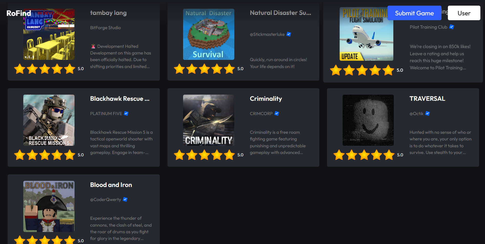

# RoFind

> Discover games worth playing, shared by the people who actually play them.

> I've been working on the desktop version but for now I'll push more features on the web version! (6/13/2026)

---

## Screenshots

*These are early screenshots.*

## What is RoFind?

RoFind is an open-source platform where players recommend, rate, and discover games together.

Inspired by Better Discovery - Mariage Sorcière on Roblox.

## Planned Features

- Browse games submitted by the community
- Rate and leave reviews
- Filter by genre, author, or popularity
- Submit your own game for others to find
- Login to save your reviews and ratings

## Roadmap

- [x] Game submission system
- [ ] User profiles
- [ ] Rating & review system
- [ ] Search & filtering
- [ ] Moderation tools

## License

MIT License. See `LICENSE`.

---

Built by the community, for the community.